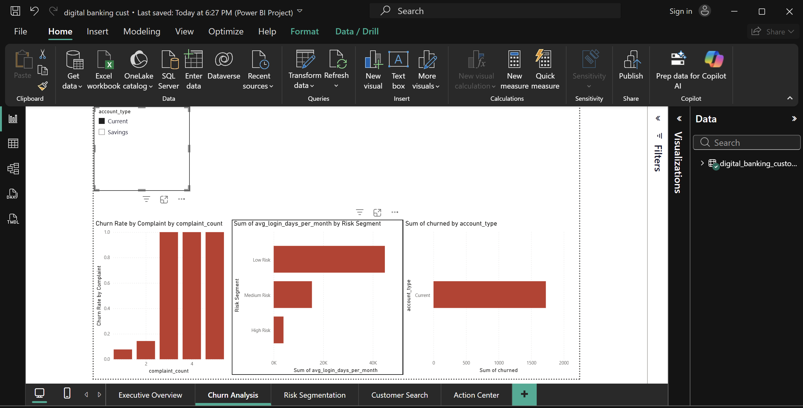
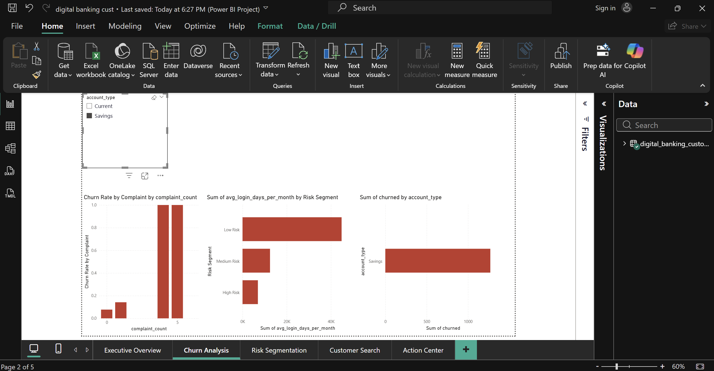
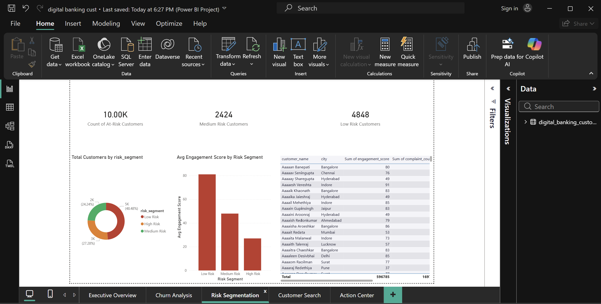
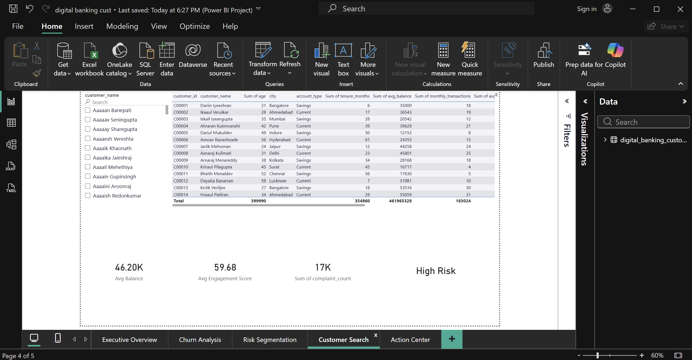
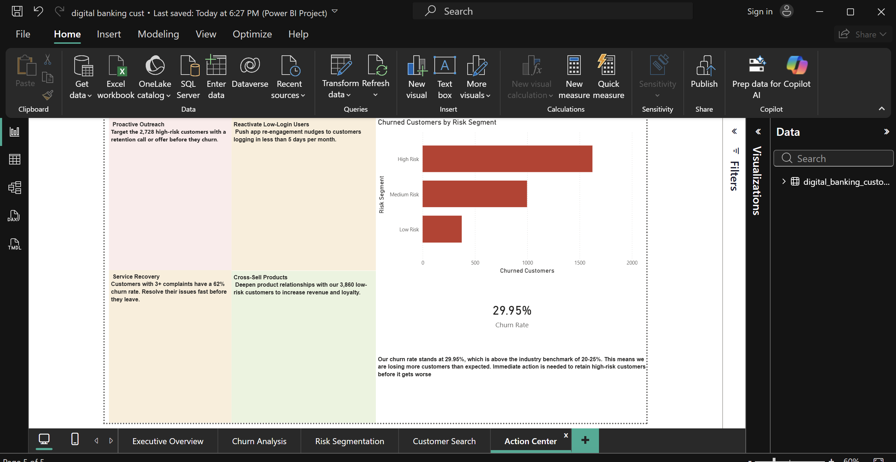

# digital-banking-customer-analytics
Digital banking customer analytics project featuring churn prediction, risk segmentation, Python-based analysis, and an interactive Power BI dashboard.
# Digital Banking Customer Analytics

## About the Project

I built this project to explore how data analytics can be used to understand customer behavior in digital banking. The project focuses on customer churn, engagement, and risk analysis using Python and Power BI.

The idea was to simulate a real banking environment where analysts need to identify customers who are likely to leave, understand the factors driving churn, and provide insights that can help improve customer retention.

## What This Project Does

* Generates a realistic digital banking customer dataset using Python
* Analyzes customer engagement and churn patterns
* Classifies customers into risk segments
* Identifies high-risk customers who may require intervention
* Provides customer-level insights and recommendations
* Visualizes key metrics through an interactive Power BI dashboard

## Tools Used

* Python
* Visual Studio Code (VS Code)
* Power BI
* CSV
* Git & GitHub

## Development Environment

The Python scripts for data generation and customer analytics were developed in Visual Studio Code. Power BI was used to build an interactive dashboard for visualizing customer churn, engagement, and risk metrics.

## Key Areas of Analysis

### Customer Churn

Examines the percentage of customers leaving the bank and identifies factors associated with churn.

### Risk Segmentation

Groups customers into High Risk, Medium Risk, and Low Risk categories based on their engagement levels, complaints, and banking activity.

### Customer Engagement

Analyzes digital banking activity, transaction behavior, and customer interactions to understand engagement patterns.

### Customer Value Analysis

Segments customers based on account balances and activity levels to highlight high-value customers.

## Dashboard Highlights

The Power BI dashboard provides:

* Total customer overview
* Churn rate analysis
* Customer segmentation
* Account type analysis
* Interactive filtering and exploration
* Business-focused insights
  # Digital Banking Customer Analytics

## Dashboard Preview

## Project Structure

* Python scripts for data generation and analysis
* CSV dataset containing 10,000 customer records
* Power BI dashboard for visualization
* GitHub repository for version control and documentation

## Why I Built This

I built this project to strengthen my data analytics skills by working on a fintech-focused use case. Using Python in VS Code, I generated and analyzed customer banking data, then used Power BI to create a dashboard that presents key business insights related to customer churn, engagement, and risk.

The project helped me gain practical experience in data analysis, business intelligence, and dashboard design while exploring challenges commonly faced by digital banking institutions.

## Future Improvements

* Machine learning-based churn prediction
* Fraud detection analysis
* Customer lifetime value modelling
* More advanced Power BI visualizations
* Real-time data integration

## Author

Adwaith Nambiar
